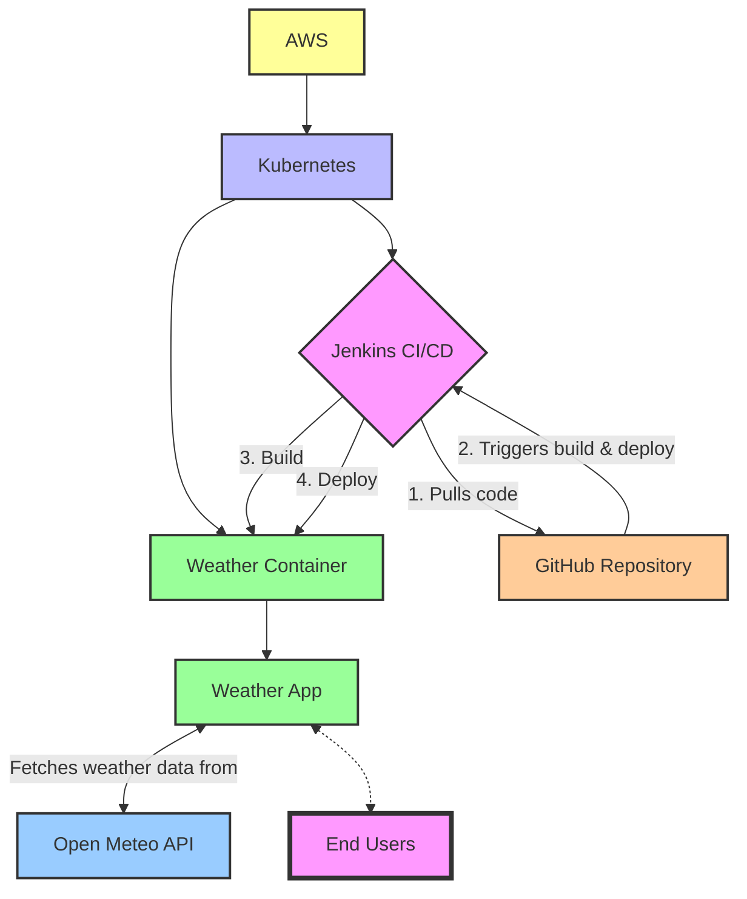

# sample_code_4

**Microservice Deployment Project**

- The project demonstrates:
  - Setting up a Kubernetes cluster using Terraform.
  - Deploying Jenkins for CI/CD.
  - Running a microservice that provides current weather information for Washington, DC.
- Project structure includes:
  - Terraform configurations for cloud infrastructure setup.
  - A Dockerized Python Flask application for the microservice.
  - Kubernetes deployment configurations.
  - Automation scripts.

## Workflow Diagram



## Prerequisites

- AWS CLI and configured AWS account access
- Terraform installed
- kubectl installed and configured
- Helm installed
- Docker installed

### Automation Scripts

Two scripts automate the setup and deployment process:

- `setup.sh`: Sets up the Kubernetes cluster and installs Jenkins.
- `deploy_microservice.sh`: Triggers the microservice deployment pipeline in Jenkins.

To run the setup script:

```bash
chmod +x scripts/*.sh
./scripts/setup.sh
```

To deploy the microservice:

```bash
./scripts/deploy_microservice.sh
```

To clean up the resources:

```bash
./scripts/cleanup_destroy.sh
```

## Usage

After deployment, the microservice will be accessible through the Kubernetes service URL. You can get the service's external IP using:

```bash
kubectl get svc weather-service
```

## License

[MIT](LICENSE)

- [Choose an open source license | Choose a License](https://choosealicense.com/)
