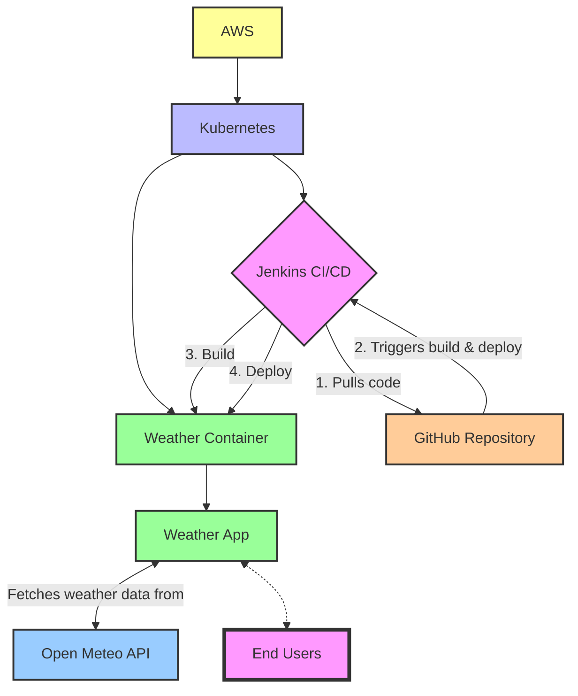

# sample_code_4

**Microservice Deployment Project**

- The project demonstrates:
  - Setting up a Kubernetes cluster using Terraform.
  - Deploying Jenkins for CI/CD.
  - Running a microservice that provides current weather information for Washington, DC.
- Project structure includes:
  - Terraform configurations for cloud infrastructure setup.
  - A Dockerized Python Flask application for the microservice.
  - Kubernetes deployment configurations.
  - Automation scripts.

## Workflow Diagram



## Automation Steps

1. Setup AWS infrastructure using Terraform.
2. Install Jenkins on the Kubernetes cluster.
3. Configure Jenkins to build and deploy the microservice.

- Manual:
  - Generate API token for Jenkins.
  - Create credentials for DockerHub.
  - Create credentials for EKS cluster.

### ToDos

- [x] Verify weather-app deployment works.
- [ ] Via Jenkins API, create API Credentials and provide to automation Bash script.
  - [x] Partially automated workaround in place.
- [ ] Via Jenkins API, configure EKS cluster credentials & DockerHub credentials.
  - Current workaround is to complete manually)
- [ ] Create deployment verification script to wait on successful Jenkins job
- [ ] At end of script, try to see if weather-app URL can be retrieved.

#### Research

- [Remote Access API](https://www.jenkins.io/doc/book/using/remote-access-api/)
  - Cannot find a way to create any credentials via the API.
- [jenkinsapi · PyPI](https://pypi.org/project/jenkinsapi/)
  - Does not have capability to create credentials.
- [Python Jenkins — Python Jenkins 1.8.0 documentation](https://python-jenkins.readthedocs.io/en/latest/index.html)
  - Documentation states it can create these artifacts, but it is very involved.

## Prerequisites

- AWS CLI and configured AWS account access
- Terraform installed
- kubectl installed and configured
- Helm installed
- Docker installed

### Automation Scripts

Prep the bash scripts for execution:

```bash
chmod +x scripts/*.sh
```

To run the setup script:

```bash
./scripts/setup.sh
```

To clean up the resources:

```bash
./scripts/cleanup_destroy.sh
```

## License

[MIT](LICENSE)

- [Choose an open source license | Choose a License](https://choosealicense.com/)
