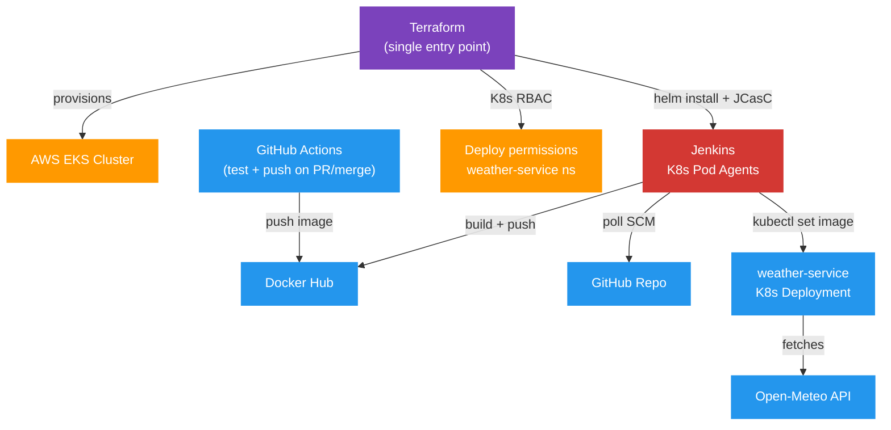

# Weather Service — EKS + Jenkins + Terraform

End-to-end infrastructure automation for a containerized microservice. A single `terraform apply` provisions an EKS cluster, deploys Jenkins via Helm, and configures the full CI/CD pipeline — no manual steps, no stored credentials.

## Architecture


```mermaid
graph TD
    TF["Terraform<br/>(single entry point)"] -->|provisions| EKS[AWS EKS Cluster]
    TF -->|helm install + JCasC| JNK["Jenkins<br/>K8s Pod Agents"]
    TF -->|K8s RBAC| RBAC[Deploy permissions<br/>weather-service ns]

    GHA["GitHub Actions<br/>(test + push on PR/merge)"] -->|push image| REG[Docker Hub]
    JNK -->|poll SCM| GH[GitHub Repo]
    JNK -->|build + push| REG
    JNK -->|kubectl set image| SVC["weather-service<br/>K8s Deployment"]
    SVC -->|fetches| API[Open-Meteo API]

    classDef tf     fill:#7b42bc,color:#fff,stroke:none
    classDef aws    fill:#ff9900,color:#fff,stroke:none
    classDef jenkins fill:#d33833,color:#fff,stroke:none
    classDef app    fill:#2496ed,color:#fff,stroke:none
    class TF tf
    class EKS,RBAC aws
    class JNK jenkins
    class SVC,GHA,GH,REG,API app
```

## Stack

| Layer | Technology |
|---|---|
| Cloud | AWS — EKS, IAM, VPC, EBS |
| IaC | Terraform 1.6+ — modular layout with remote-state config |
| Auth | IRSA (IAM Roles for Service Accounts) — no static AWS credentials in pods |
| CI/CD | Jenkins on K8s (Helm-managed, JCasC) + GitHub Actions |
| App | Python / Flask — Dockerized, with `/health` probe and pytest suite |
| K8s | Deployment, Service, HPA, ResourceQuota, liveness/readiness probes |
| Dev environment | Devcontainer — Ubuntu 24.04, all CLI tools, LocalStack, local registry |

## Repository Layout

```
├── .devcontainer/
│   ├── Dockerfile               Ubuntu 24.04 + Terraform, kubectl, Helm,
│   │                            AWS CLI v2, Docker CLI, k9s
│   ├── docker-compose.yml       workspace + LocalStack + local Docker registry
│   ├── devcontainer.json        Cursor/VS Code config — extensions, port forwards
│   └── scripts/
│       ├── shell-init.sh        Custom PS1, tab completion, aliases
│       └── post-create.sh       First-run setup: venv, git config, tool summary
├── infrastructure/              Terraform — all provisioning
│   ├── modules/
│   │   ├── vpc/                 VPC, subnets, IGW, route tables
│   │   ├── iam/                 EKS cluster + worker node IAM roles
│   │   ├── eks/                 EKS cluster, node group, OIDC provider
│   │   └── jenkins/             Jenkins Helm release, IRSA role,
│   │                            K8s RBAC, JCasC pipeline/credential config
│   ├── versions.tf              Provider version pins
│   ├── backend.tf               Remote state config (S3 + DynamoDB, opt-in)
│   ├── variables.tf             Input variables with descriptions
│   ├── terraform.tfvars.example Copy and fill in to deploy
│   ├── main.tf                  Provider config + module wiring
│   └── outputs.tf               Cluster name, Jenkins access commands
├── microservice/
│   ├── src/
│   │   ├── app.py               Flask app — /health + / with error handling
│   │   ├── test_app.py          pytest suite (success, timeout, API errors)
│   │   └── requirements.txt
│   ├── k8s/                     Deployment, Service, HPA, ResourceQuota
│   └── Dockerfile
├── ci-cd/
│   └── Jenkinsfile              Declarative pipeline — K8s pod agents,
│                                Docker-in-Docker build, IRSA deploy
└── .github/
    └── workflows/ci.yml         GitHub Actions — test on PR, push image on merge
```

## Development Environment

The repo ships with a devcontainer. Open it in Cursor or VS Code and everything is pre-installed — no local toolchain required.

**Requires:** Docker (OrbStack or Docker Desktop) and Cursor / VS Code with the Dev Containers extension.

### What's included

| Tool | Version |
|---|---|
| Terraform | 1.9 |
| kubectl | 1.30 |
| Helm | 3.16 |
| AWS CLI | v2 (latest) |
| k9s | 0.32 |
| Python | 3.12 + venv |
| Docker CLI | latest (uses host daemon via socket mount) |

### Compose services

Two sidecar services start alongside the workspace container:

| Service | Port | Purpose |
|---|---|---|
| **LocalStack** | 4566 | Local AWS emulation — S3 and DynamoDB for Terraform remote state, IAM, STS, EC2. EKS requires LocalStack Pro (`LOCALSTACK_AUTH_TOKEN`). |
| **Local registry** | 5000 | Local Docker registry — push images here instead of DockerHub during development. |

### Shell prompt

The terminal prompt updates on every command:

```
sample_code_4 | main | ~/workspace/ci-cd $
```

`awslocal` is pre-aliased to `aws --endpoint-url http://localstack:4566`.

### Bootstrap LocalStack state backend (optional)

To run `terraform apply` against LocalStack instead of real AWS:

```bash
awslocal s3 mb s3://tfstate-local
awslocal dynamodb create-table \
  --table-name terraform-state-lock \
  --attribute-definitions AttributeName=LockID,AttributeType=S \
  --key-schema AttributeName=LockID,KeyType=HASH \
  --billing-mode PAY_PER_REQUEST
```

Then uncomment and update `infrastructure/backend.tf` to point at `http://localstack:4566`.

## How It Works

Terraform is the single entry point. One `terraform apply` does all of this:

1. **VPC** — two public subnets across AZs, internet gateway, route tables
2. **IAM** — EKS cluster role, worker node role, EBS CSI policy
3. **EKS** — cluster, managed node group, OIDC provider for IRSA
4. **EBS CSI driver** — installed via Helm so PersistentVolumes work
5. **Jenkins namespace + DockerHub secret** — K8s secret mounted into the Jenkins pod; JCasC reads it at `/run/secrets/additional/` so credentials never appear in state
6. **IRSA role for Jenkins** — Jenkins pods authenticate to AWS using their service account annotation, not static keys; the IAM policy is scoped to `eks:DescribeCluster` only
7. **K8s RBAC** — Role + RoleBinding granting the Jenkins service account `patch`/`update` on Deployments in the `weather-service` namespace; no cluster-admin
8. **Jenkins Helm release with JCasC** — pipeline job, DockerHub credentials, and global env vars (`AWS_REGION`, `EKS_CLUSTER_NAME`) are all configured on first boot; Jenkins is usable immediately after `terraform apply` completes

## Deploy to AWS

```bash
cp infrastructure/terraform.tfvars.example infrastructure/terraform.tfvars
# Edit terraform.tfvars — set dockerhub_username, dockerhub_password, github_repo_url
# (or export TF_VAR_* environment variables)

chmod +x scripts/*.sh
./scripts/setup.sh
```

The script runs `terraform apply`, then updates your local kubeconfig. After it completes, Terraform prints the commands to retrieve the Jenkins admin password and port-forward to `localhost:8080`.

## Local Development

```bash
# Run the Flask app
python microservice/src/app.py   # respects $PORT, defaults to 5000

# Run tests
pytest microservice/src/test_app.py -v
```

## Tear Down

```bash
./scripts/cleanup_destroy.sh
```

## Notes

**Remote state** — `backend.tf` contains a commented S3 backend configuration. Uncomment and set `bucket`/`dynamodb_table` before running `terraform init` to enable shared state with locking.

**Secrets** — DockerHub credentials are passed as Terraform variables and stored as a Kubernetes Secret. For production, replace with AWS Secrets Manager + [External Secrets Operator](https://external-secrets.io).

**Jenkins credentials** — The `dockerhub-credentials` credential ID is pre-configured by JCasC. Set `DOCKERHUB_USERNAME` and `DOCKERHUB_TOKEN` as GitHub Actions secrets for the GHA build path.

**Node sizing** — Worker nodes default to `t3.large`. Adjust `node_instance_type` in `terraform.tfvars` for cost or workload requirements.

## License

[MIT](LICENSE)
